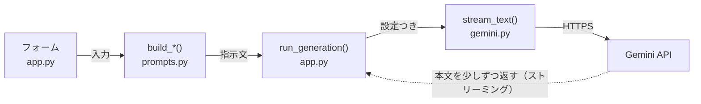
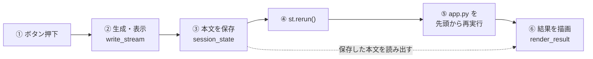

# app.py の歩き方

AI Writing Studio の画面を作っている 355 行を、上から順に読み解きます。
Streamlit が初めてでも追えるように、「なぜこう書いてあるのか」を中心に説明します。

> 対象: `app.py`（355 行） ／ Python + Streamlit + Gemini API

---

## このファイルの役割

いきなり結論から言うと、**app.py の仕事は「画面を描くこと」だけ**です。
AI に文章を書かせる処理そのものは、このファイルには 1 行も入っていません。

プロジェクトは 4 つのファイルに分かれていて、役割はきれいに分担されています。

| ファイル | 担当 |
| --- | --- |
| `app.py` | 画面。入力欄を並べ、ボタンを置き、結果を表示する |
| `writer/prompts.py` | 入力から「AI への指示文」を組み立てる |
| `writer/gemini.py` | Gemini API と通信する唯一の窓口 |
| `writer/config.py` | モデル一覧などの設定値 |

この分担には理由があります。`app.py` は Streamlit に強く依存していますが、
`writer/` の 3 つは Streamlit を一切知りません。
だから画面を使わずにコマンドラインから動作確認できますし、
将来「コマンドライン版も欲しい」となったときも `writer/` はそのまま使い回せます。

1 回の生成でデータがどこを通るのかを図にすると、こうなります。



破線の戻り線が、この画面の「文字がパラパラ出てくる」体験を作っている部分です。
完成した文章が一度に返るのではなく、途中経過が少しずつ `run_generation()` に届きます。

---

## 最重要: 画面は毎回作り直される

app.py を読む前に、Streamlit の大前提をひとつだけ理解しておく必要があります。
これを知らないとコードの半分が意味不明に見えます。

> **大前提**
> Streamlit は、**ユーザーが何か操作するたびに app.py を 1 行目から最後まで丸ごと実行し直します。**
> ボタンを押しても、スライダーを動かしても、タブを切り替えても、毎回です。

だから、ファイルの一番下がこうなっています。

```python
# app.py:340-355
def main() -> None:
    st.title(f"{config.APP_ICON} {config.APP_TITLE}")
    ...

main()
```

普通の Python なら `if __name__ == "__main__":` で囲うところですが、
ここでは `main()` がむき出しで呼ばれています。
「このファイルは毎回上から下まで走る使い捨てのスクリプト」という前提なので、囲う意味がないのです。

そして、この性質から次の 3 つが導かれます。app.py の設計はほぼこれで説明がつきます。

- **普通の変数には何も残せない。**
  再実行のたびに消えるので、残したいものは `st.session_state` という専用の箱に入れる。
- **入力欄は `st.form` でまとめる。**
  囲っておくと、中の入力欄をいくら触っても再実行が起きません。
  送信ボタンを押した瞬間だけ、全部の値がまとめて確定します。
  これが無いと、テキストを 1 文字打つたびに画面全体が作り直されて重くなります。
- **すぐ反応させたいボタンはフォームの外に置く。**
  「クリア」ボタンがフォームの外にあるのはこのためです。

---

## サイドバー

`render_sidebar()`（23-69 行）は、左側の設定パネルを描いて、
選ばれた設定を `main()` に返します。仕事は 3 つです。

1. API キーの状態を確認し、未設定なら入力欄を出す
2. 使う AI モデルを選ばせる
3. 「考える深さ」を選ばせる

ここで少し変わって見えるのが、関数の冒頭にあるこの 1 行です。

```python
# app.py:28-31
# 画面から入力されたキーを毎回セットし直す（再描画されても保持するため）。
gemini.set_api_key(st.session_state.get("api_key_input"))

has_key = bool(gemini.get_api_key())
```

「毎回セットし直す」のは、まさに**毎回スクリプトが最初から走るから**です。
入力されたキーは `st.session_state` に残っているので、そこから取り出して
`writer/gemini.py` に渡し直しています。ファイルには一切書き込みません。

モデルの選択肢は、この関数の中に直接書かれてはいません。

```python
# app.py:51-57
model_id = st.selectbox(
    "モデル",
    options=[m.id for m in config.MODELS],
    format_func=lambda mid: config.MODELS_BY_ID[mid].label,
    index=[m.id for m in config.MODELS].index(config.DEFAULT_MODEL),
)
st.caption(config.MODELS_BY_ID[model_id].note)
```

`config.MODELS` を読んでいるだけなので、
**使えるモデルを増やしたいときは `writer/config.py` に 1 行足すだけ**で、
画面の選択肢が自動で増えます。app.py は触りません。

関数の最後は `return model_id, thinking_level, has_key` です。
この 3 つが `main()` を経由して、各タブに配られていきます。

---

## 生成の心臓部

`run_generation()`（92-127 行）が、このファイルで一番重要な関数です。
3 つのタブすべてが、最後はここに合流します。

```python
# app.py:102-127（抜粋）
result = gemini.StreamResult()

st.caption("生成中…")
try:
    st.write_stream(
        gemini.stream_text(
            model=model_id,
            system_instruction=system_instruction,
            prompt=prompt,
            thinking_level=thinking_level,
            max_output_tokens=config.estimate_max_output_tokens(target_chars),
            result=result,
        )
    )
except gemini.GeminiError as exc:
    st.error(str(exc))
    return

st.session_state[f"result_{key}"] = result.text
st.session_state[f"usage_{key}"] = _usage_caption(result.usage)
st.rerun()
```

やっていることは 3 ステップです。

1. `st.write_stream()` で、届いた文章を届いた端から画面に流す
2. 完成した本文を `st.session_state` に保存する
3. `st.rerun()` で画面を作り直す

### なぜ最後に st.rerun() が要るのか

ここが一番わかりにくいところなので、図で説明します。



②で流れていた文字は、④の再実行で一度消えます。
画面に残るのは、③で保存され⑥で描き直されたほうです。
`st.rerun()` を外すと、次に何か操作した瞬間に結果が消えてしまいます。

つまり `st.rerun()` は、
**「流れていく表示」から「保存された表示」へバトンを渡すための一手**です。
これがあるおかげで、あとでタブを切り替えて戻ってきても結果が残っています。

### 結果に名前空間を付ける

保存先のキーが `f"result_{key}"` となっているのがポイントです。
`key` には `"blog"` / `"email"` / `"summary"` が入るので、
3 つのタブの結果が互いに上書きし合いません。
ブログを書いたあとに要約タブへ行っても、ブログの結果は残ったままです。

### エラーは 2 段構え

`except gemini.GeminiError` しか捕まえていない点にも意図があります。
API 由来のエラーは `writer/gemini.py` の中で
「API キーが正しくありません」のような日本語に変換されてから投げられるので、
app.py はそれをそのまま `st.error()` に流すだけで済みます。
**エラー文言を直すときは app.py ではなく gemini.py を触る**、という分担です。

---

## 結果の表示

`render_result()`（130-164 行）は、保存済みの結果を 3 つの形で見せます。
冒頭の 3 行がこの関数の性格を表しています。

```python
# app.py:132-134
text = st.session_state.get(f"result_{key}")
if not text:
    return
```

**保存された結果が無ければ、何も描かずに帰る。**
毎回スクリプトが再実行されることを思い出してください。
この関数は毎回呼ばれますが、結果が無いうちは黙っているわけです。

| 表示 | 用途 |
| --- | --- |
| プレビュー | `st.markdown()` で整形して表示。見出しや箇条書きが反映される |
| コピー用テキスト | `st.code()` で生の文字列を表示。右上にコピーボタンが付く |
| ダウンロード | 日時入りのファイル名で `.md` として保存 |

ついでに `_usage_caption()`（74-89 行）にも触れておきます。
使ったトークン数を表示する小さな関数ですが、
`getattr(usage, attr, None)` と、あえて遠回りな書き方をしています。
Gemini の SDK が返す項目名は将来変わる可能性があるので、
**項目が無くてもエラーにせず、あるものだけ表示する**ようにしてあります。

---

## 3 つのタブ

`tab_blog()` / `tab_email()` / `tab_summary()` の 3 つは、
入力項目が違うだけで**骨格はまったく同じ**です。1 つ読めば 3 つとも読めます。

```python
# tab_blog / tab_email / tab_summary に共通する形
with st.form("form_xxx"):
    # ① 入力欄を並べる
    submitted = st.form_submit_button(..., disabled=not has_key)

if submitted:
    if not 必須項目.strip():
        st.warning("...を入力してください。")   # ② 入力チェック
    else:
        system, prompt = prompts.build_xxx(...)  # ③ 指示文を組み立てる
        run_generation("xxx", ...)               # ④ 生成する

render_result("xxx", "xxx")                      # ⑤ 結果を描く
```

注目してほしいのは `disabled=not has_key` です。
API キーが無いときはボタンが押せなくなるので、
「押したらエラーが出る」ではなく「そもそも押せない」形で防いでいます。

もうひとつ、入力欄の一部が `st.expander`（「さらに細かく指定する」）の中に
畳まれています。必須項目だけを表に出して、こだわりたい人だけが開く構成です。
畳まれていても値はちゃんと読まれるので、機能上の差はありません。

---

## まとめ役の main()

```python
# app.py:340-352
def main() -> None:
    st.title(...)
    st.caption(...)

    model_id, thinking_level, has_key = render_sidebar()

    blog, email, summary = st.tabs(["ブログ記事", "メール文面", "文章要約"])
    with blog:
        tab_blog(model_id, thinking_level, has_key)
    with email:
        tab_email(model_id, thinking_level, has_key)
    with summary:
        tab_summary(model_id, thinking_level, has_key)
```

サイドバーから設定を受け取り、それを 3 つのタブに配るだけ。
**判断を何もしていないのが良い `main()`** です。
ここが薄いほど、機能を足すときに壊しにくくなります。

> **小さな注意**
> `st.tabs()` は 3 つのタブの中身を**すべて実行します**。
> 表示されていないタブも動いているので、重い処理をタブの中に直接書くと全体が遅くなります。
> このアプリでは重い処理（API 通信）がボタンを押したときだけ走るので問題ありません。

---

## タブを 1 つ増やしてみる

構造がわかると、機能追加は決まった手順になります。
たとえば「SNS 投稿文を作る」タブを足すなら、こうです。

1. `writer/prompts.py` に `build_social()` を書く。
   既存の `build_blog()` をまねて、`(system, prompt)` を返せば OK
2. `app.py` に `tab_social()` を足す。上の「共通する形」をそのままなぞる
3. `main()` の `st.tabs([...])` にタブ名を 1 つ足して、`with` ブロックを 1 つ増やす

`run_generation()` と `render_result()` は触りません。
新しい `key`（たとえば `"social"`）を渡すだけで、
保存も表示もダウンロードも付いてきます。

---

## 覚えておくと迷わない 3 つ

- **画面は毎回作り直される。**
  残したいものは `st.session_state` へ。app.py の設計はほぼこれで説明がつきます。
- **app.py は画面だけ。**
  AI の呼び出しは `writer/gemini.py`、指示文は `writer/prompts.py`、
  設定は `writer/config.py`。直したい場所に迷ったら、この分担を思い出してください。
- **3 つのタブは同じ形。**
  フォーム → チェック → 指示文 → 生成 → 表示。1 つ読めれば全部読めます。

---

行番号は現時点の `app.py`（355 行）のものです。コードを編集するとずれるので、
関数名で探すほうが確実です。
